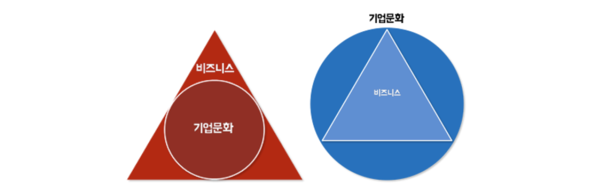

## Do: Work

- `채용 커피챗`: 여느 때와 다름없이 팀에 관심 가져주시는 분들과 고객과 제품 그리고 팀에 대한 이야기를 나누는 자리를 가졌습니다. 그중 이야기 나누는 내내 생동감 있는 시간을 보낸다는 생각이 들었던 분이 계셨는데요. 특히 챌린지하고자 하는 열정과 프론트엔드 시스템 엔지니어링에 대한 관심과 역량이 느껴져 다음 전형을 진행하게 되었습니다. 🙂
- `다중 워크스페이스 지원을 위한 사전 코드 작업`: 현재 볼타 서비스는 1개의 계정이 1개의 워크스페이스에 소속되는 구조(1:1)입니다. 고객이 늘어나면서, 하나의 계정으로 여러 워크스페이스를 관리하고 싶다는 VoC가 종종 들어오고 있었는데요. 신규 기능 개발 시 약간 텀이 발생할 때를 이용하여 이를 지원하기 위한 사전 코드 작업을 해두었습니다. 처음 제품을 개발할 때부터 1:N 구조가 될 수 있다고 판단하고 확장할 수 있게끔 구조를 잡아두어서 금방 마무리할 수 있었습니다.
- `감사기록 사전 코드 작업`: 감사기록(Audit History)는 특정 리소스의 변경 이력을 기록/관리하는 기능을 부르는 용어입니다. 기존에는 사용자에게 보여지지는 않고 운영을 위해서만 저장하고 있었는데요. 볼타 서비스를 자금 업무 협업 목적으로 사용하는 고객이 늘어나면서 사용자에게 제공하기 위한 코드 작업을 진행했습니다.
- `세금계산서 발행 처리 아키텍처 고도화`: 볼타 서비스는 세금계산서 발행이 트리거되는 부분이 다양합니다.(관리자의 간편발행, 예약발행, 멤버가 올린 요청에 대한 관리자의 발행승인, 수정발행 등) 그리고 이들의 자세한 데이터 모델과 전처리/후처리 로직도 미세하게 다른데요. 조금 더 고도화 할 수 있는 부분이 보여 약간의 작업을 진행 했습니다.
- `Next Feature Overall Sketch`: 2024년 8주차에 릴리즈될 예정인 2개의 기능에 대한 팀 단위 스케치와 사전 설계를 진행 했습니다.

## Do: Academic

### `Detail about Amazon, Coupang`
- Customer Obsession의 대가로 알려진 Coupang과 Amazon에 대한 창업 초기 이야기를 살펴보았습니다.
- 여러가지 이야기가 있었지만 지금은 널리 알려진 내용을 10년, 15년 전에 이미 이야기하고 있었다는 부분이 놀라웠는데요.
- 그 중 쿠팡 김범석 대표님의 `창업하면 누구나 하기 쉬운 5가지 실수`가 인상 깊었습니다.

1. `모든 것을 잘하려고 한다`
    - 스타트업은 특히나 가지고 있는 자원이 한정적이다.
    - 창업 초기에는 모든 의사결정에 회사의 생사가 걸려 있기 때문에 모든 것을 다 챙기려고 하는 실수를 저지른다.
    - 한가지의 핵심 경쟁력을 파악하고 그것에 집중하라
    - `올해 다른건 다 포기해도 꼭 이루어 내야하는 한 가지는 무엇인가?`라는 질문에 답할 수 있어야 한다.
2. `고객이 아닌 경쟁에 집중한다`
    - 장기적인 성공은 결국 고객이 결정한다.
    - 고객은 내부 고객(팀원)과 외부 고객(제품을 사용하는 사람들)로 나뉜다.
    - 쿠팡은 매출이 3억원 나올 당시에도 외부 고객 만족을 위해 상담원 인력을 100명으로 파격적 증원했다.
    - 경쟁사와의 상대적인 순위가 시장을 결정하기보다는 내부 고객과 외부 고객의 만족이 성공을 결정 짓는다.
3. `선입견 또는 문화적 결정론에 빠진다`
    - 쿠팡의 모든 조직은 수평 조직 방식으로 운영되고 있다.
    - 처음 도입시에 `'한국에서는 이런 시도가 어차피 통하지 않을 것이다.'`라는 부정적 의견이 나왔다.
    - 하지만 지금은 쿠팡 직원들의 만족도가 높은 문화로 자리매김했다.
    - 만약 한국적 문화에만 함몰 되어 있었다면 2002년 히딩크의 기적이 가능했을까?
    - `동서양의 장점이 융합된 기업 문화를 지향하자`
4. `구성 인력에 맞춰 사업을 운영한다`
    - 사업 확장기에는 자연스레 인력을 충원 할 필요가 생긴다.
    - 조직을 새로 구성할 때 기존 구성원들의 입사 순서나 사업 기여도를 고려한다.
    - 하지만 그 정도가 사업의 방향을 좌지우지할 정도가 되어서는 안 된다.
    - `사업과 성장에 맞춰 인력을 과감히 구성 해야 한다`
5. `문화보다 실적을 먼저 챙긴다`
    - 쿠팡은 인재를 크게 두 가치 축, `실적`과 `가치관`을 바탕으로 평가한다.
    - 이에 따른 네 가지 분류 중 조직에서 가장 문제인 사람은 실적은 좋지만 가치관이 안 맞는 사람, 즉 독(poison)에 속하는 사람이다.
    - 장기적으로 독(poison)보다는 물음표(?)에 속하는 사람이 별(star)가 될 수 있도록 과감하게 기용할 수 있어야 한다.
    - 비즈니스를 성립 시키기 위해서 기업문화가 존재하는 것이 아니라 기업문화를 성취하기 위한 도구로서 비즈니스가 존재하는 것이다.
    - `문화가 없으면 장기적인 성과도 없다`

쿠팡이 인재를 보는 시각

김범석 대표님의 시각에서는 우측에 보이는 것 처럼 기업문화가 비즈니스를 아우른다.

### `Frontend System Engineering`

서비스 개발에 있어서 가장 중요한 부분은 서비스 개발 속도를 효율적으로 끌어올려 비즈니스를 성공시키는 데 기여해야 한다는 점입니다. 처음에는 손이 가는 대로 제품을 만들어내는 게 가장 빠릅니다. 하지만 팀원이 하나둘 늘어나고 기능이 수십 개를 넘어가는 순간 개발이 느려집니다. 제품을 만드는 `개발자들은 어떻게든 이 비효율을 해소`하여야만 합니다.

제품 개발 시 다양한 부분에서 느려질 수 있겠지만, 최근에는 Frontend Engineering 영역에 대한 비효율 해소하기 위한 방법에 집중하고 있습니다. 특히 개발자는 직관적으로 사용할 수 있고, 디자이너의 의도도 충분히 반영 가능하지만 시스템 수준에서 의도하지 않은 사용은 방지하는 디자인 시스템 구현체는 어떤 인터페이스를 가져야 할까? 고민하고 있습니다.

볼타는 현재 고객에게 제공되고 있는 서비스 외에도 몇 가지 서비스를 더 준비하고 있는데요. 미래에 출시 될 제품과 서비스에서도 볼타의 브랜드를 잘 녹여내면서도 UX의 유려함을 지켜내기 위해 고민하고, 준비해 나가면서 여러가지 아티클과 영상을 살펴보는 시간을 가졌습니다. 

## Think

`Frontend Engineering Deep-Dive`: 최적화, 공통화, DX, UX 등 부가적인 부분을 향상하기 위해 여러 가지를 고민하고 있습니다. 이를 위해선 Frontend Engineering 영역을 조금 더 깊게 파악해 볼 필요가 있으나 여전히 깊게 살펴보지 못하고 있어 항상 아쉬움이 듭니다. 다음 주에는 오픈소스 Design System을 조금 살펴보고, Next.js를 이용한 `One Day Semi Project`를 한 개 해보면서 조금 더 익숙해져보려고 합니다.