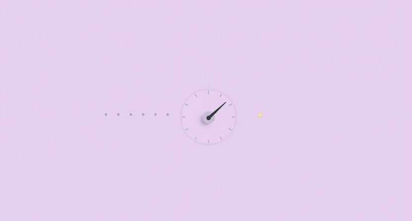

## "하고 싶은데 지겹다"

좋아서 시작한 일인데 어느 순간 손이 안 간다. 재밌었던 프로젝트가 슬슬 루틴이 되고, 처음에는 설레던 출근길이 어느 날부터 무감각해진다. 능력이 부족한 것도 아니고, 흥미를 잃은 것도 아니다. 분명 좋아하는 일인데, 몸과 마음이 반응하지 않는다. "하고 싶은데 지겹다"는 모순적인 상태.

이건 의지의 문제가 아니다. 뇌가 원래 그렇게 작동한다. 같은 자극이 반복되면 반응이 줄어드는 건 결함이 아니라 설계다. 문제는 이 설계를 무시하고 의지력으로 버티려 할 때 생긴다.

## 익숙해지면 반응이 줄어든다

처음 먹는 음식은 맛이 강렬하다. 하지만 같은 음식을 매일 먹으면, 어느 순간부터 맛을 잘 못 느끼게 된다. 음식이 변한 게 아니라 혀가 적응한 것이다. 뇌도 마찬가지다. 동일한 자극이 반복되면, 뇌는 그것을 "이미 아는 것"으로 분류하고 반응의 강도를 낮춘다. 에너지를 아끼기 위한 합리적인 전략이다.

이건 일에서도 똑같이 일어난다. 새로운 기능을 처음 만들 때의 흥분, 첫 고객을 만났을 때의 떨림, 팀에 합류한 직후의 긴장감. 시간이 지나면 이 모든 것이 무뎌진다. 능숙해진다고도 할 수 있지만, 뒤집으면 둔감해진다는 뜻이기도 하다. 역량은 반복에서 오지만, 동력도 반복 속에서 사라진다. 이 역설이 모든 프로덕트, 모든 조직, 모든 커리어에서 반복된다.

## 예상이 빗나가는 순간

그렇다면 둔감해진 뇌를 다시 깨우는 건 뭘까. 답은 의외로 단순하다. 예상이 빗나가면 된다.

사람의 뇌는 끊임없이 다음에 무슨 일이 일어날지 예측한다. 출근하면 슬랙에 메시지가 쌓여 있을 거고, 스탠드업 미팅에서는 어제와 비슷한 이야기가 나올 거고, 오후에는 코드 리뷰를 할 것이다. 이 예측이 맞을수록 뇌는 에너지를 절약하고, 동시에 무감각해진다. 그런데 갑자기 예측이 깨지면 — 예상하지 못한 피드백이 오거나, 전혀 다른 방향의 제안이 나오거나, 당연하다고 생각한 전제가 뒤집히면 — 뇌는 다시 깨어난다. "어? 이건 뭐지?" 이 한 순간의 각성이 쌓인 무감각을 리셋한다.

놀라움의 본질은 화려함이 아니다. 예상과 현실 사이의 간극이다. 그 간극이 클수록, 리셋도 강력하다.

## 놀라움에는 타이밍이 있다

그렇다고 아무 때나 예상을 깨버리면 되는 건 아니다. 충분히 익숙해지기 전에 놀라움을 주면, 그건 놀라움이 아니라 혼란이다. 기본 규칙도 모르는 상태에서 규칙이 뒤집히면, 사람은 "재밌다"가 아니라 "모르겠다"고 느낀다.

놀라움이 작동하려면, 먼저 "이건 이런 거구나"라는 확신이 생겨야 한다. 반복을 통해 패턴을 익히고, 다음을 예측할 수 있다는 자신감이 쌓인 상태에서, 그 예측이 빗나가야 효과가 있다. 다시 말해, 지루함이 먼저 있어야 놀라움이 빛난다. 지루함 없는 놀라움은 소음이고, 놀라움 없는 지루함은 이탈이다. 둘은 따로 존재할 수 없다.

## 프로덕트의 리듬

이걸 프로덕트에 적용하면 명확해진다. 온보딩은 반복의 영역이다. 사용자가 서비스의 규칙을 배우고, 핵심 동작을 익히고, "이건 이렇게 쓰는 거구나"라는 감각을 형성하는 단계. 이 단계에서 중요한 건 일관성이다. 예측 가능한 경험이 반복되어야 사용자는 안심하고 배운다.

문제는 그 다음이다. 온보딩이 끝나고 사용자가 서비스에 익숙해지면, 반복은 리텐션의 적이 된다. 매일 같은 화면, 같은 기능, 같은 흐름. 뇌가 "이미 아는 것"으로 분류하는 순간, 서비스를 열 이유가 사라진다. 이 시점에 필요한 것이 예상 밖의 경험이다. 새로운 기능의 발견, 예상치 못한 추천, 기존 흐름을 깨는 이벤트. 이것들이 사용자의 뇌를 다시 깨운다.

좋은 프로덕트는 이 두 가지를 교차시킨다. 반복으로 신뢰를 쌓고, 적절한 놀라움으로 신선함을 유지하는 리듬. 한쪽에만 치우치면 실패한다.

## 조직에도 리듬이 필요하다

프로덕트만 그런 것이 아니다. 조직도 같은 리듬으로 돌아간다.

스프린트, 데일리 스탠드업, 주간 회의, 월간 리뷰. 이런 루틴은 조직의 반복 학습이다. 예측 가능한 리듬 속에서 구성원은 자기 역할을 익히고, 팀의 작동 방식을 체화한다. 이 루틴이 없으면 조직은 혼란스럽다. 하지만 루틴만 있으면 조직은 지루하다.

그래서 좋은 조직에는 루틴을 깨는 순간이 설계되어 있다. 오프사이트, 해커톤, 역할 교체, 전혀 다른 프로젝트에 잠시 참여하기. 이런 것들이 쌓인 무감각을 리셋한다. 중요한 건, 이것들이 자연발생하는 게 아니라 의도적으로 배치된다는 점이다. 좋은 리더는 팀이 언제 지루해지는지를 감지하고, 그 시점에 맞춰 리듬을 깨는 경험을 넣을 줄 안다.

## 지루함을 견디게 하는 건 다음 놀라움에 대한 기대다

반복이 고통스러워도 버틸 수 있는 이유가 있다. "조금만 더 하면 뭔가 다른 일이 일어날 것이다"라는 기대. 이 기대는 근거 없는 낙관이 아니라, 과거에 실제로 놀라움을 경험한 기억에서 온다. 이전에도 지루한 시기를 지나면 새로운 국면이 열렸으니까, 이번에도 그럴 거라는 신뢰.

리듬이 신뢰를 만든다. "반복 → 놀라움 → 반복 → 놀라움"이라는 패턴을 몇 번 겪으면, 반복의 시기에도 "곧 뭔가 올 것이다"라는 감각이 생긴다. 이 감각이 있으면 지루함은 고통이 아니라 축적이 된다. 다음 단계를 위해 힘을 모으는 시간. 반대로 이 리듬이 없는 조직, 놀라움 없이 반복만 계속되는 조직에서는 사람이 버티지 못한다. 이탈의 원인은 대부분 과로가 아니라 무감각이다.

## 지루함을 설계하는 사람들

제품을 만드는 사람이라면 누구든 이 리듬을 다루게 된다. 기획자는 기능의 배치 순서를, 개발자는 사용자가 마주할 흐름의 완급을, 리더는 팀이 반복과 변화를 오가는 주기를 설계한다. 역할은 다르지만 본질은 같다. "언제 지루하게 할 것인가"를 아는 것.

이건 직관적이지 않은 능력이다. 보통은 지루함을 문제로 보고, 그걸 없애려고 한다. 하지만 지루함을 없애면 역량도 같이 사라진다. 반복 없이는 숙련이 없고, 숙련 없이는 놀라움도 작동하지 않는다. 지루함은 버그가 아니라, 다음 단계를 위한 토양이다.

결국 좋은 제품을 만드는 사람들이 하는 일은 단순하다. 지루함과 놀라움 사이에 리듬을 만드는 것. 그리고 그 리듬을 통해, 사람들이 지치지 않고 계속 앞으로 나아갈 수 있게 하는 것이다.
