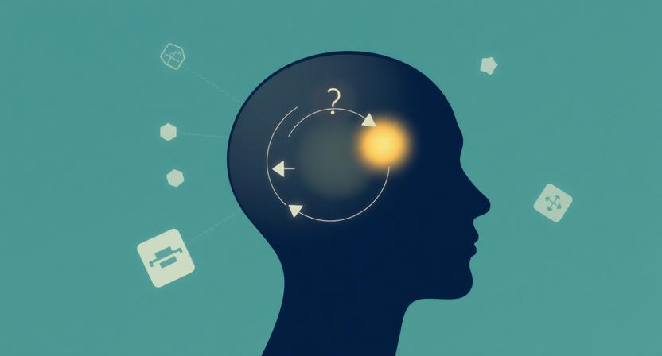

## "그냥 느낌이 그래서"

"그냥 느낌이 그래서." 어떤 결정의 이유를 물었을 때, 이 말만큼 강력하면서도 설명 불가능한 대답이 있을까. 나도 종종 이런 식으로 판단을 내린다. 채용 면접에서 지원자의 이력은 훌륭한데 어딘가 찜찜한 느낌이 들 때, 제품의 방향을 두 가지 중 하나로 골라야 할 때, 혹은 처음 가본 식당에서 메뉴판을 3초 만에 훑고 주문을 결정할 때.

흥미로운 건, 이 "느낌"이 생각보다 자주 맞는다는 것이다. 아니, 정확히 말하면 맞았던 기억만 선명하게 남는 것일 수도 있다. 하지만 분명한 건, 직관이 잘 작동하는 사람과 그렇지 않은 사람이 있다는 것이다. 그리고 그 차이는 타고난 재능이 아니라, 구조에 있다고 생각한다.

최근 체험 디자인에 관한 책을 읽다가 직감이 어떻게 만들어지는지에 대한 흥미로운 관점을 발견했다. 게임 디자인을 분석한 책이었는데, 거기서 말하는 직감의 구조가 일과 삶에도 그대로 적용된다는 걸 깨달았다. 직감은 하늘에서 뚝 떨어지는 것이 아니라, 정교하게 설계되고 축적되는 것이었다.

## 뇌는 늘 다음을 상상한다

우리 뇌에는 재미있는 성질이 하나 있다. 뭔가를 보면 자동으로 "이걸 해볼까?"라는 가설을 세우고 싶어 한다는 것이다. 용도를 알 수 없는 기계를 봐도, 핸들 같은 게 보이면 "돌려볼까?", 버튼이 보이면 "눌러볼까?" 하는 생각이 저절로 든다. 아무도 "이 기계의 사용법에 대해 생각해보라"고 말한 적이 없는데도.

심리학에서는 이걸 어포던스(affordance)라고 부른다. 환경이 우리에게 부여하는 행동 가능성. 거창하게 들리지만, 쉽게 말하면 문 손잡이를 보면 자연스럽게 "잡아서 당겨볼까?"라는 생각이 드는 것이다. 의자를 보면 앉고 싶어지고, 계단을 보면 올라가고 싶어진다.

이걸 일하는 맥락으로 가져오면, 좋은 제품은 사용자가 "이걸 눌러볼까?"라는 가설을 자연스럽게 세울 수 있도록 만들어진 제품이다. 반대로, 설명서를 읽어야만 쓸 수 있는 제품은 어포던스가 부재한 제품이다. 그리고 이건 제품에만 적용되는 게 아니다. 좋은 조직도 구성원이 "이렇게 해볼까?"라는 가설을 자유롭게 세울 수 있는 환경을 만든다. 누군가 시키지 않아도, 자발적으로 다음 행동을 상상하게 되는 곳. 그게 어포던스가 살아있는 조직이다.

## 감이 만들어지는 세 단계

직감이 작동하는 구조를 뜯어보면, 세 단계로 나뉜다.

첫째, 가설이다. "이렇게 하면 되지 않을까?"라는 추측을 세운다. 이건 의식적으로 하는 분석이 아니라, 경험과 환경이 결합해서 자동으로 떠오르는 것이다. 둘째, 시행이다. 가설을 실제로 실행에 옮긴다. "한번 해보자"라는 마음으로 행동한다. 셋째, 환희다. 가설이 맞았을 때 느끼는 기쁨이다. "역시 내 생각이 맞았어!"라는 순간.

이 세 단계가 중요한 이유는, 단순히 한 번의 판단으로 끝나지 않기 때문이다. 가설을 세우고, 시행하고, 맞았을 때 기뻐하는 사이클이 반복되면서 비로소 "감"이라는 것이 형성된다. 한 번의 성공은 우연이지만, 이 사이클을 수십 번, 수백 번 반복하면 패턴이 된다. 그리고 그 패턴이 체화되면, 우리는 그것을 직관이라고 부른다.

스타트업을 하면서 느끼는 것도 비슷하다. 처음에는 모든 의사결정이 막막하다. 하지만 가설을 세우고 실행하고, 맞거나 틀린 결과를 반복적으로 경험하다 보면, 어느 순간 비슷한 상황에서 "이건 이렇게 해야 해"라는 감각이 생긴다. 그 감각의 정체가 바로 이 사이클의 축적이다.

## 가설은 어디서 오는가

그렇다면 가설은 어디서 오는가. 허공에서 "이렇게 해볼까?"라는 생각이 갑자기 떠오르는 건 아니다. 가설의 방향을 결정하는 건 환경이 보내는 신호, 즉 시그니파이어(signifier)다.

시그니파이어는 어포던스를 전달하기 위해 설계된 단서다. 슈퍼 마리오에서 마리오의 모습, 위치, 주변의 산과 풀이 모두 시그니파이어다. 이 단서들이 "오른쪽으로 가봐야 할 것 같다"는 가설을 플레이어의 머릿속에 심는다. 아무도 "오른쪽으로 가세요"라고 말하지 않았는데, 화면의 모든 요소가 그 방향을 가리키고 있는 것이다.

이걸 일에 적용하면, 좋은 리더는 시그니파이어를 잘 설계하는 사람이다. 팀원에게 "이걸 해"라고 지시하는 게 아니라, 팀원이 자발적으로 "이렇게 해볼까?"라는 가설을 세울 수 있도록 맥락과 정보를 배치하는 것이다. 명확한 목표, 적절한 권한, 그리고 충분한 맥락. 이 세 가지가 갖춰지면 팀원의 직감은 자연스럽게 올바른 방향을 향한다. 반대로, 모든 걸 지시하는 조직에서는 구성원의 직감이 퇴화한다. 가설을 세울 기회 자체가 없으니까.

## 처음이 모든 것을 결정한다

직감의 구성요소 중 하나가 초두효과다. 무언가를 처음 접했을 때, 우리의 집중력과 학습 효율은 가장 높다. 그리고 그 처음의 경험이 이후의 모든 판단에 기준점이 된다.

슈퍼 마리오가 첫 스테이지에 모든 핵심 아이템을 집중시킨 이유도 이것이다. 플레이어의 집중력이 가장 높은 순간에 게임의 규칙을 학습시키면, 이후에는 그 규칙이 직감처럼 작동한다. 불합리해 보이지만, 가장 약한 적인 굼바(쿠리보)가 가장 중요한 적인 이유이기도 하다. 집중력이 높은 초반에 등장하기 때문에, 플레이어의 기억에 가장 깊이 각인된다.

제품을 만들면서도 이 원리를 체감한다. 사용자가 서비스에 처음 들어왔을 때의 경험이 이후 모든 판단의 기준이 된다. 온보딩에서 "이건 쓸 만한 서비스다"라는 직감이 형성되면, 이후 작은 불편함은 넘어간다. 반대로, 첫 경험에서 혼란을 겪으면 아무리 좋은 기능이 뒤에 있어도 사용자의 직감은 "이건 아니다"라고 말한다. 처음이 전부를 결정하는 건 아니지만, 처음이 직감의 방향을 결정하는 건 분명하다.

## 같은 말이 다르게 들리는 이유

같은 정보를 받아도, 그걸 어떤 마음 상태에서 받느냐에 따라 해석이 완전히 달라진다. 게임에서 오른쪽으로 가는 것이 맞다는 사실을 발견했을 때, 플레이어가 느끼는 기쁨은 단순히 "정답을 알았다"는 것에서 오지 않는다. 가설을 세우고, 불안한 가운데 실행하고, 그 과정에서 심리적 긴장이 쌓였기 때문에 비로소 환희가 크다.

이걸 "마음의 문맥"이라고 부를 수 있다. 직감은 정보 자체가 아니라, 그 정보를 받아들이는 시점의 심리적 맥락에 의존한다. 같은 피드백이라도, 고민 끝에 듣는 피드백과 아무 맥락 없이 듣는 피드백은 흡수되는 깊이가 다르다. 스스로 충분히 고민한 뒤에 받은 조언은 직감의 일부가 되지만, 고민 없이 받은 조언은 그냥 정보로 흘러간다.

조직에서도 마찬가지다. 팀원이 스스로 충분히 고민할 시간을 준 뒤에 방향을 제시하면, 그건 직감의 재료가 된다. 하지만 고민할 틈도 없이 답을 던져주면, 그건 시키는 일이 될 뿐이다. 마음의 문맥을 만들어주는 것, 그게 직감을 키우는 환경의 핵심이다.

## 직감이 자라는 세 가지 조건

직감이 잘 작동하려면 세 가지 조건이 필요하다.

첫째, 충분히 긴 시간을 직감으로 채워야 한다. 어떤 일을 시작하고 "재밌다"거나 "감이 온다"고 느끼기까지는 시간이 걸린다. 빠르면 몇 분, 늦으면 몇십 분. 그 시간 동안 끊임없이 작은 가설과 시행의 사이클을 돌려야 한다. 중간에 그 흐름이 끊기면 직감은 리셋된다.

둘째, 하나하나의 사이클은 짧게 완결되어야 한다. 가설을 세웠는데 검증까지 한 달이 걸린다면, 그 사이에 불안과 지루함이 직감을 잠식한다. 작은 가설을 빠르게 세우고, 빠르게 확인하고, 결과를 바로 체감하는 것. 이 속도감이 직감을 선명하게 만든다.

셋째, 가설이 맞을 확률이 어느 정도 보장되어야 한다. 세운 가설이 매번 틀리면, 사람은 가설 세우기를 그만둔다. 적절한 난이도, 적절한 성공률이 있어야 "다음에도 해봐야지"라는 동기가 유지된다. 이건 게임뿐 아니라 일에서도 마찬가지다. 너무 어려운 과제만 주어지는 환경에서는 직감이 위축된다. 적절한 성공 경험이 쌓여야 직감이 자라난다.

## 나도 모르게 손이 먼저 움직일 때

직감이 완전히 체화되면, "나도 모르게" 작동한다. 의식적으로 분석하지 않아도 손이 먼저 움직이고, 머리가 먼저 답을 내놓는다.

이 "나도 모르게"야말로 직감의 가장 큰 힘이다. 체험 디자인에서도 최고의 디자인은 사용자가 "나도 모르게" 무언가를 하고 싶어지게 만드는 것이라고 말한다. 지시하지 않았는데 하고 싶어지고, 설명하지 않았는데 이해하게 되고, 강요하지 않았는데 몰입하게 되는 것.

돌이켜보면, 내가 가장 좋은 결정을 내렸던 순간들은 대부분 논리적 분석보다 직감이 먼저였다. 물론 그 직감은 하늘에서 온 게 아니라, 비슷한 상황을 여러 번 겪으면서 무의식에 축적된 패턴이었다. 중요한 건, 그 패턴이 축적되기까지의 과정에 가설과 시행과 환희가 있었다는 것이다.

## 설명할 수 없는 것이 아니라, 압축된 것이다

직감은 타고나는 것이 아니라 구조적으로 만들어진다. 어포던스가 가설을 유도하고, 시그니파이어가 방향을 잡아주고, 가설→시행→환희의 사이클이 반복되면서 패턴이 쌓인다. 초두효과가 첫 번째 기준점을 세우고, 마음의 문맥이 경험의 깊이를 결정한다.

결국 직감을 키운다는 건, 좋은 가설을 많이 세워보고, 빠르게 시행해보고, 맞았을 때의 기쁨을 충분히 느끼는 것이다. 그리고 그 환경을 스스로 만들거나, 함께 일하는 사람들에게 만들어주는 것이다.

"그냥 느낌이 그래서"라는 말 뒤에는, 셀 수 없이 많은 가설과 시행과 실패와 환희가 쌓여 있다. 직감은 설명할 수 없는 것이 아니라, 설명하기엔 너무 많은 경험이 압축되어 있는 것이다.
