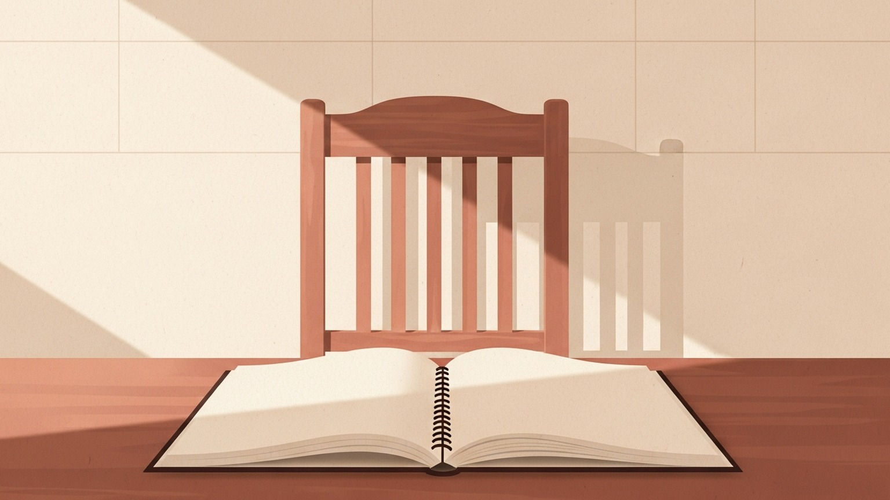

## 같은 단어, 다른 사람

채용 공고 앞에 앉으면 같은 단어를 본다. 개발자. 그 단어가 가리키는 사람의 모습은 시기마다 달랐다. 한 시기에는 자판을 빨리 치는 사람이었고, 한 시기에는 알고리즘을 깊게 아는 사람이었으며, 또 한 시기에는 새벽까지 모니터를 응시하는 사람이었다. 단어는 그대로인데 그 안에 들어 있는 사람의 모습이 매번 바뀌었다.

요즘 그 단어가 또 한 번 비어 가는 중이다. 자판은 더 이상 빠를 필요가 없고, 외워 둔 라이브러리는 어제의 가치만큼만 가치 있고, 새벽까지 모니터를 응시하는 일도 점점 줄어든다. 단어 안의 사람이 비워지는 자리에, 다른 종류의 사람이 들어오고 있다. 누군지 아직은 잘 보이지 않는다.

## 손이 가벼워지는 시간

손이 가벼워진다는 말을 자주 듣는다. 코드를 짜는 일이 가벼워지고, 화면을 만드는 일이 가벼워지고, 데이터를 옮기는 일이 가벼워진다. 키보드 위의 손은 점점 같은 일을 점점 적게 한다. 한 사람의 손으로 1년 걸리던 일이 두세 달로 줄어들고, 두세 달 걸리던 일이 며칠로 줄어드는 풍경이 도처에 펼쳐진다.

이 가벼워짐을 처음 본 사람들의 반응은 비슷하다. 두려움과 안도가 동시에 도착한다. 두려운 것은 자기 손의 가치가 사라진다는 감각이고, 안도하는 것은 더 이상 손으로 그 모든 것을 끌고 가지 않아도 된다는 사실이다. 두려움과 안도는 같은 사건의 두 얼굴이다.

가벼워진 손은 어디로 가는가. 사라지지 않는다. 손이 하던 일을 하지 않게 될 뿐이다. 그 손은 다른 자리에 놓여야 한다. 어디에 놓일 것인가, 그 질문에 회사도 사람도 아직 답을 갖고 있지 않다.

지금은 저수준의 일에서 손이 가벼워졌다. 화면 한 장을 그리는 일, 한 모듈을 만드는 일, 데이터를 옮기는 일. 머지않아 더 위쪽의 일에서도 손이 가벼워질 것이다. 시스템 전체의 그림을 그리는 일, 위험을 미리 보는 일, 트레이드오프를 정리하는 일. 시간 차이일 뿐 방향은 같다. 가벼워짐은 위로 올라간다.

## 무엇을 만들지 모르는 자리

회사 안에 가장 자주 흐르는 침묵은 어떻게 만들지 앞이 아니라 무엇을 만들지 앞에서 흐른다. 어떻게 만들지는 누군가 답을 안다. 자료가 있고, 사례가 있고, 검색이 있고, 이제는 AI가 있다. 그러나 무엇을 만들지에 관해서는 자료도 사례도 답을 주지 못한다. 그 자리는 누군가가 자기 판단으로 채워야 하는 자리다.

대부분의 조직은 이 자리에서 멈춰 있다. 만들 손은 충분한데 만들지가 정해지지 않는다. 어떤 고객을 위해 어떤 문제를 풀 것인가. 이 기능과 저 기능 중 무엇이 다음 1년을 결정하는가. 풀고 나면 무엇이 좋아진다고 말할 수 있는가. 이 질문 앞에서 자주 사람이 부족해진다. 손이 부족한 게 아니라, 답을 함께 만들어 줄 머리가 부족하다.

회사가 채용 공고를 올릴 때 적는 단어는 여전히 개발자다. 그러나 그 자리에서 회사가 진짜로 사고 있는 것은 손이 아니다. 함께 결정해 줄 사람이다. 이 차이는 공고문의 문장만으로는 잘 드러나지 않지만, 면접에 들어가면 금방 드러난다. 면접관이 던지는 질문이 점점 어떻게 짤 것인가에서 무엇을 풀 것인가로 옮겨가고 있다.

## 손과 머리의 자리 바꾸기

이 변화가 처음은 아니다. 한 세기 전에도 비슷한 일이 있었다. 그때도 손이 가벼워졌다. 베틀이 멈추고, 방적기가 돌아가고, 망치가 기계로 바뀌었다. 사람은 무엇을 만들 것인가, 어떤 순서로 만들 것인가, 어떤 품질을 어디까지 허용할 것인가를 정하는 자리에 남았다. 자리가 비워지는 것이 아니라 옮겨졌다. 한 세대의 직업이 사라지고, 다른 세대의 직업이 만들어졌다. 단어는 그대로인데 안의 사람이 바뀌었다.

같은 모양의 사건이 지금 사무실에서 일어난다. 손이 빠른 사람을 비싸게 사던 시대가 닫히고 있다. 그 자리에 비싸게 팔리는 것은 다른 종류의 사람이다. 무엇을 만들지를 정의하는 사람, 만들지 않을 것을 결정하는 사람, 만든 것을 어떤 기준으로 좋다고 부를지를 합의해 가는 사람.

악보를 읽을 줄 아는 사람이 많아진다고 해서 지휘자가 사라지지는 않는다. 오히려 누구나 연주할 수 있는 시대일수록, 무슨 곡을 어떤 박자로 함께 연주할지 정하는 사람의 자리가 무거워진다. 채용 공고에 적힌 개발자라는 단어는 그대로지만, 그 단어가 가리키는 사람의 일은 바뀌었다. 가리키는 자리가 손에서 머리 쪽으로 천천히 이동하고 있다.

이 자리는 직급으로 표현하면 흔히 팀장급이라 불린다. 그러나 팀장급은 직급의 이름이 아니라 사고의 위치다. 자기 코드만 책임지는 자리에서, 무엇을 만들 것인가에 답을 내야 하는 자리로 옮겨간 사람. 그 자리에 어울리는 사람이 점점 귀해지고 있다.

## 다음에 뽑힐 사람

손이 빨라서 살아남던 시대는 점점 끝나간다. 손이 빠른 사람을 회사가 더 이상 비싸게 사지 않는다. 그 자리에 비싸게 팔리는 사람은 무엇을 만들지 정의해 줄 사람, 만드는 일과 만들지 않는 일 사이에서 함께 골라 줄 사람이다.

채용 공고 앞에 다시 앉는다. 같은 단어가 눈에 들어온다. 개발자. 그 단어 안에 어떤 사람이 들어 있는지 다시 한번 들여다보면 좋다. 그 자리에서 회사가 진짜로 찾고 있는 것이 손인지, 판단인지.
