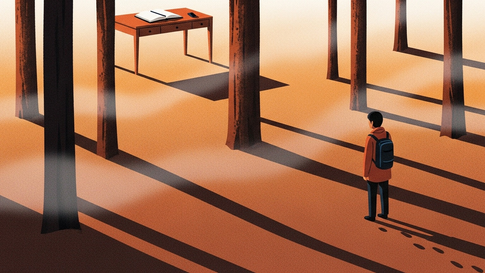

회의실과 모니터 사이에 앉아 있는 시간이 실력과 비례한다는 믿음이 있다. 엉덩이가 무거운 사람이 결국 이긴다는 말이 그렇고, 늦게까지 불을 켜둔 자리에 자부심을 붙이는 습관이 그렇다. 그런데 실제로 깊은 판단이 내려졌던 순간을 거꾸로 되감아 보면, 그건 자리 앞에서 쥐어짠 결과인 경우가 드물다. 오히려 책상을 떠나 있던 시간, 혹은 전혀 다른 곳을 바라보고 있던 시간에서 온다.

좋은 결과와 오래 앉아 있음 사이에는 직선이 없다. 둘은 나란히 놓인 다른 차원이다. 데이터와 근성으로는 채울 수 없는 영역이 있고, 그 영역은 대개 "책상 바깥"이라 불리는 시간에 조용히 채워진다.

### 욕조에서 풀린 문제

아르키메데스가 왕관의 비밀을 풀어낸 장소는 연구실이 아니라 욕조였다. 몸을 담그는 순간 넘쳐 흐르는 물을 보고, 오랫동안 책상에서 매달리던 부피 측정의 원리를 깨달았다. 그는 옷도 제대로 걸치지 않은 채 거리로 뛰쳐나갔다고 전해진다.

수학자 앙리 푸앵카레도 비슷한 경험을 『과학과 방법』에 직접 기록해두었다. 몇 달간 풀리지 않던 푹스 함수의 구조가, 연구실이 아니라 지질학 답사를 위해 마차에 오르는 순간 떠올랐다. "발을 발판에 올려놓는 바로 그 순간, 해답이 완전히 번뜩였다." 그는 덧붙인다. 책상 앞에서는 아무리 오래 붙어 있어도 나오지 않던 구조가, 거기서 떠난 뒤 거의 저절로 솟았다고.

두 사람의 공통점은 분명하다. 책상을 떠난 순간에 책상의 문제를 풀었다는 것. 이것은 우연도 기적도 아니다. 뇌가 작동하는 방식 그 자체다.

### 뇌는 쉴 때 정리한다

2001년, 워싱턴 의대의 마커스 라이클은 fMRI로 뇌를 관찰하다가 이상한 현상을 발견했다. 피험자가 아무 과제도 수행하지 않을 때, 오히려 뇌의 특정 영역들이 활발하게 움직이고 있었다. 내측 전전두엽, 후측 대상피질, 하두정소엽. 그는 이 회로에 "Default Mode Network(DMN)"라는 이름을 붙였다.

DMN은 멍하니 창밖을 볼 때, 샤워를 하는 동안, 산책길 위에서 가장 활발해진다. 그리고 이 회로가 하는 일은 흥미롭다. 지금까지 쌓인 기억을 재배열하고, 떨어져 있던 정보 사이에 다리를 놓고, 아직 오지 않은 장면을 시뮬레이션한다. 의식적 몰입이 정보를 한 점으로 모으는 수렴이라면, DMN은 정보를 섞고 연결짓는 확산이다.

근성으로 책상에 붙어 있는 시간은 이 회로를 오히려 꺼둔다. 수렴 엔진이 과열되는 동안 확산 엔진은 식는다. 그리고 확산 엔진이 식은 사람에게서는, 아무리 재료가 많아도 연결이 일어나지 않는다.

### 수렴과 확산, 두 개의 엔진

심리학자 J.P. 길포드는 사고를 두 종류로 나눈 적 있다. 수렴적 사고(convergent thinking)와 확산적 사고(divergent thinking). 수렴은 하나의 정답을 향해 파고드는 힘이고, 확산은 여러 가능성을 펼치며 멀리까지 뻗는 힘이다. 시험 문제는 대부분 수렴을 요구하지만, 실제 일의 난제는 거의 언제나 확산을 요구한다.

책상은 수렴의 공간이다. 반대로 산책로, 샤워실, 지하철, 부엌은 확산의 공간이다. 좋은 판단은 이 두 공간을 오가며 나온다. 수렴만 하는 사람은 날카롭지만 좁고, 확산만 하는 사람은 넓지만 공허하다. 한쪽 엔진만으로 비행기는 뜨지 않는다.

그런데 현대의 지식 노동자 대부분은 한쪽 엔진만 과열시킨다. 책상 앞의 시간을 실력의 증명이라 여기면서, 그 엔진을 식힐 시간을 일종의 사치로 취급한다. 사치라고 여기던 그 시간이, 실은 나머지 절반의 엔진이었다.

### 사냥꾼의 눈

사냥꾼은 사냥감만 보지 않는다. 바람의 방향, 나뭇잎의 뒤집힌 각도, 젖은 흙 위의 희미한 자국, 숲의 소리가 잠시 멎는 구간. 이 단서들을 동시에 읽어야 한다. 교과서에 쓰여 있지 않은 이 읽기는, 오로지 많은 숲을 걸어본 사람만이 할 수 있다. 목적을 가지고 걷는 숲만으로는 부족하다. 아무 목적 없이 걸었던 숲도 그 감각의 일부가 된다.

책상 앞에 앉은 사람은 자주 '문제'만 본다. 해결해야 할 지표, 답을 내야 할 의제, 마감이 걸린 페이지. 시야가 좁아지는 건 자연스럽다. 하지만 그 문제를 둘러싼 '숲'은 책상 위에 없다. 퇴근길의 표지판, 주말에 들른 낯선 동네의 간판, 취미로 고른 책의 한 줄, 키우는 식물이 시드는 방식. 업무와 아무 상관 없어 보이는 이런 장면들이, 어느 순간 문제의 본질을 비추는 단서가 된다.

목적 없이 바라보는 시간에만 감각은 본능의 층위로 내려앉는다. "이걸 써먹어야지"라고 준비하는 순간 그것은 이미 수렴이고, 수렴된 정보는 확장을 잃는다. 숲을 읽는 감각은 특별히 고안된 훈련이 아니라, 오랫동안 숲을 쏘다닌 덕분에 남겨진 흔적이다.

### 리더의 퇴근이 조직의 품질이다

취미 없는 리더의 판단에는 공통점이 있다. 모든 판단의 재료를 '업무 맥락' 하나에서만 길어온다. 회의에서 나오는 언어도, 문제를 바라보는 각도도, 사례로 드는 은유도 모두 같은 우물에서 퍼 올린 물이다. 물맛이 점점 얇아지는 것을 본인만 모른다.

반대로 전혀 다른 영역에 발을 담그는 리더가 있다. 주말에 목공을 하거나, 달리기를 하거나, 요리를 하거나, 무언가를 기르는 사람. 그런 리더가 꺼내는 질문의 결은 다르다. "이 프로젝트는 조립이 아니라 조각처럼 접근해야 할 것 같아요"라거나, "지금은 물을 더 주면 안 되는 단계 같아요" 같은 말이 나온다. 은유가 풍부한 사람은 대개 은유를 인위적으로 만든 게 아니라, 오래 쌓아둔 다른 세계의 감각을 꺼낸 것뿐이다.

이것은 한가로움이 아니라 재료 수급이다. 잘 퇴근하는 리더가 회의에서 더 좋은 질문을 던지는 것은 여유가 있어서가 아니라, 서로 다른 영역에서 퍼 올린 감각이 서로를 비추기 때문이다. 조직의 판단 품질은 결국 그 조직을 이끄는 사람의 삶이 얼마나 넓은지에 수렴한다.

### 취미에 효율을 요구하지 말 것

"이 취미가 내 업무에 도움이 될까?"를 묻는 순간, 그 취미는 이미 업무의 연장이 된다. 질문의 모양이 바뀌었을 뿐 수렴 엔진은 여전히 켜져 있다. 감각의 토양은 무용(無用)의 시간에서 자란다.

장자는 쓸모없는 것의 쓸모, 무용지용(無用之用)을 말했다. 큰 나무가 굽고 옹이가 많아 목수가 쓸 수 없다고 버려둔 덕분에, 그 나무는 잘려나가지 않고 오래 살아 그늘을 드리웠다. 쓸모없다는 이유로 살아남은 것이, 결국 더 큰 쓸모가 되었다.

직감에 이자를 붙이고 싶다면 취미에서 효율을 기대해서는 안 된다. 이자는 목적 없이 쌓은 시간에서만 붙는다. "이게 나중에 쓸모 있을까"를 묻지 않고 몰입했던 순간들이, 훗날 전혀 예상치 못한 자리에서 직감의 일부가 되어 되돌아온다. 효율을 기대한 취미는 업무가 되고, 업무가 된 취미는 더 이상 감각을 키우지 못한다.

### 의자에서 일어나는 일

오래 앉아 있는 것이 실력이 아니라, 잘 일어나는 것이 실력이다. 좋은 판단에 필요한 재료의 절반은 의자 위에 없기 때문이다. 의자는 재료를 정돈하는 자리이고, 의자 바깥은 그 재료가 모이는 자리다. 재료 없는 정돈은 공허하고, 정돈 없는 재료는 무질서하다. 둘은 번갈아 작동해야 하는 한 쌍이다.

숲을 많이 걸어본 사람만 숲의 흔적을 읽을 수 있다. 같은 이치로, 책상 바깥의 시간을 충분히 보낸 사람만이 책상 위의 문제를 다른 각도에서 볼 수 있다. 오늘의 좋은 판단은 지난 주말의 산책에서 왔고, 내일의 통찰은 오늘 저녁의 취미에서 자라고 있다.

이번 주에 할 수 있는 일은 거창한 휴가가 아니다. 업무에 도움이 될 것 같은 책이 아니라 끌리는 책을 한 권 펼쳐보는 일. 목적 없이 동네를 한 바퀴 걸어보는 일. 효율을 묻지 않고 취미에 한 시간을 내어주는 일. 이 작은 시간들이 쌓여 조용히 직감이 된다.

책상은 씨앗을 심는 자리일 뿐이다. 그것을 길러내는 일은, 언제나 책상 바깥에서 일어난다.
