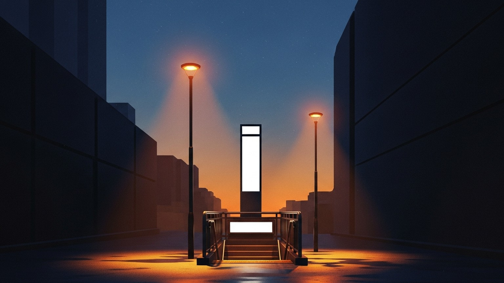

어떤 저녁은 약속된 시간을 가지고 있다. 식사가 끝나는 시간, 카페가 문을 닫는 시간, 막차가 끊기는 시간 같은 것들. 대부분의 만남은 그 시간들 중 하나에서 자연스럽게 종결된다. 그런데 어떤 저녁은 그 시간들을 한 번에 하나씩 지나친다. 처음부터 계획된 연장이 아니라, 끝을 미루는 작은 말들이 쌓여서.

## 모르는 채로 마주 앉을 때

배경이 거의 없는 채로 마주 앉는 저녁이 있다. 이름 한 줄, 사는 동네 한 줄, 일하는 곳 한 줄 정도가 전부인 상태. 검색창도, 공유된 피드도, 친구의 후기도 없다. 그런 만남은 다른 종류의 주의를 요구한다. 무엇을 아는지가 아니라, 지금 무엇을 듣고 있는지가 저녁의 결을 정한다.

마주 앉은 첫 10초가 다른 저녁보다 조금 길게 느껴졌다. 말의 속도가 잠시 달라졌고, 이어지는 문장들이 평소보다 조심스러워졌다. 어떤 이미지는 예상된 범위 바깥에 있어서, 그 범위를 잠깐 다시 그리는 시간이 필요하다. 그 10초는 그런 시간이었다.

이 글을 읽는 당신은 아마 알 것이다. 처음 마주 앉은 자리에서 말의 속도가 잠시 달라진다는 것. 그리고 그게 아무 의미 없는 일이 아니라는 것.

## 마주 앉지 않았다

우리는 마주 앉지 않았다. 둥근 소파형 의자에, 90도 각도로 앉았다. 정면은 서로를 평가하는 자세이고, 나란히는 이미 같이 있는 사람들의 자세다. 그 사이의 90도는 둘 다 아니었다 — 아직 서로에게 완전히 돌아앉지는 않았지만, 같은 방향을 살짝 바라보기 시작한 각도.

두 개의 음식을 시켜 나누어 먹었다. 각자의 접시 대신 한 식탁을 섞었다는 뜻이다. 처음 만난 저녁에 음식을 섞는다는 것은, 말보다 먼저 오는 작은 신뢰다. 누가 먼저 그렇게 하자고 했는지는 기억나지 않는다. 그런 제안은 대체로 동시에 시작된다.

그날은 술잔이 놓이지 않았다. 무언가의 도움 없이 이어진 저녁이었고, 그래서 침묵조차 맨정신이었다. 맨정신의 침묵은 술기운의 침묵과 다르다. 채워지지 않은 채로 얼마간 버티는 시간. 그런 침묵을 견딜 수 있으면 대화는 한 층 내려간다.

당신은 음식이 나왔을 때 잠시 휴대폰을 들었다. 순간을 기록하려는 사람은 순간을 가볍게 여기지 않는다. 그 짧은 행위가, 당신이 이 저녁을 그냥 지나가게 두지 않으려 한다는 뜻으로 읽혔다. 사진은 저녁이 지나간 뒤에도 저녁이 있었다는 흔적이 된다. 흔적을 남기려는 사람은, 지워지는 쪽이 아닌 남기는 쪽에 속한다.

## 한 정거장만 더

식사가 끝났을 때 우리는 카페로 가지 않고 걸었다. 앉은 대화는 정면을 마주 보지만, 걷는 대화는 같은 방향을 본다. 풍경의 같은 각도, 신호등의 같은 타이밍, 같은 속도. 그런 저녁에는 말 이상의 것이 공유된다.

걷는 동안, 나는 조금씩 움직였다. 의자가 움직인 것이 아니라 내가 당신 쪽으로 몸을 기울였다. 한 번에 몇 센티미터씩, 크게는 아니게. 그건 계획된 동작이 아니었고, 그래서 더 솔직한 방향이었다.

첫 번째로 끝을 말한 것은 나였다. “여기서 갈게요”라고 가볍게 건넸을 때, 당신은 조금만 더 가면 다음 역이라고 대답했다. 다음 역에 도착했을 때, 이번에는 “아쉽다”는 말이 내 쪽에서 먼저 나왔다. 그래서 우리는 더 멀리 있는 출구까지 걸었다.

끝을 말하는 말 뒤에 끝을 미루는 말이 이어지면, 저녁은 한 정거장을 더 얻는다. 그걸 두 번 반복하면, 저녁은 두 정거장을 더 얻는다. 그날 저녁은 두 번 연장되었고, 두 번 다 미룬 사람이 같지 않았다. 한 사람만의 아쉬움이 아니라는 뜻이다.

걷는 동안 당신은 매일 지나는 장소 하나를 가리켜 보였다. 당신의 오늘이 그 거리에 박혀 있었다. 같은 길 위에서 나는 오래전에 자주 걷던 동네 이야기를 했다. 한 거리에 두 사람의 다른 시간층이 포개져 있었다 — 당신의 오늘과 나의 과거가 같은 아스팔트를 나눠 밟고 있었다. 낯익은 거리를 다른 사람의 시선으로 다시 걷는다는 것은, 그 거리를 한 번 더 새롭게 갖는 일이었다.

## 여러 창문이 한 사람 안에

그 저녁 당신이 건넨 말 중 하나를 오래 생각한다. 한 사람 안에 여러 역할이 겹쳐지기를 바란다는 말. 어떤 날은 친구 같고, 어떤 날은 멘토 같고, 어떤 날은 부모처럼 든든한 사람. 그건 사랑에 대한 정의이기도 했고, 자신에게 거는 약속처럼 들리기도 했다.

역할이 분리된 관계는 기능적이다. 필요에 따라 필요한 쪽을 찾는다. 하지만 역할이 겹쳐진 관계는 다르다. 한 사람 안에 여러 창문이 열려 있고, 어느 창문으로 들어가도 같은 집이라는 사실을 알게 된다. 그런 집을 가진 사람은 드물다. 그리고 그런 집을 가지고 싶다고 먼저 말하는 사람은, 이미 그런 집을 반쯤 지어놓은 사람이다.

---

어떤 저녁은 예정된 출구에서 끝나지 않는다. 그리고 그런 저녁이 있다는 사실을, 우리는 지나간 뒤에야 안다. 다음 저녁에도 한 정거장을 더 걷고 싶다. 끝을 미루는 말을, 이번에는 내가 먼저 건네보고 싶다.
