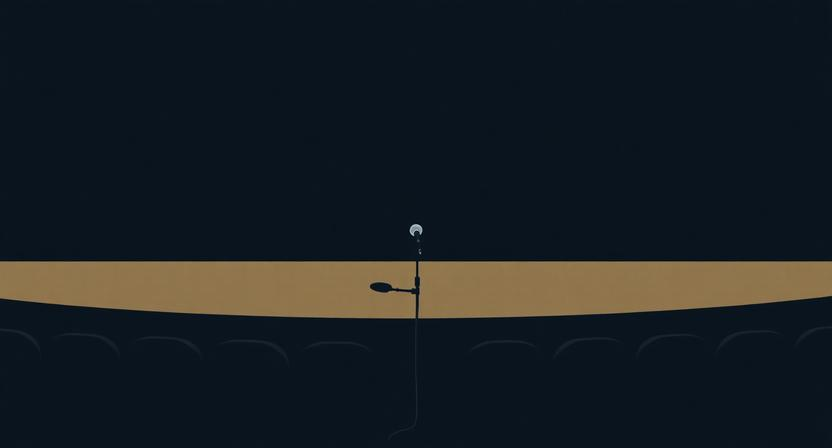

### "그때 말이 끊겼다"

발표 도중에 머릿속이 하얘진 적이 있다. 다음 슬라이드로 넘기려는데 무슨 말을 해야 할지 모르겠고, 입이 열리지 않았다. 2초, 3초. 체감으로는 30초쯤 되는 것 같은 침묵. 끝났다고 생각했다. 그런데 이상한 일이 벌어졌다. 고개를 숙이고 있던 청중이 하나둘 고개를 들었다. 노트북에서 눈을 떼고, 나를 바라보기 시작했다. 침묵이 만든 빈 공간에, 사람들의 주의가 빨려 들어온 것이다.

말을 이어가는 동안에는 아무도 집중하지 않았다. 말이 멈춘 순간에 모두가 집중했다. 그 경험이 꽤 오랫동안 머릿속에 남았다. 왜 말이 없는 순간이 말보다 강했을까.

### 말이 많아질수록 설득력이 떨어지는 이유

확신이 넘치는 사람은 말이 많아진다. 자기가 알고 있는 것을 전부 쏟아내야 할 것 같은 충동. 근거를 하나 더 대고, 사례를 하나 더 들고, 부연 설명을 하나 더 붙이면 상대가 설득될 거라는 믿음. 하지만 실제로는 반대다. 말이 많아질수록 핵심이 묻히고, 청자의 뇌는 정보를 처리하다 지쳐서 방어 모드에 들어간다.

이건 라디오 주파수와 비슷하다. 하나의 채널에서 선명한 소리가 나오면 귀가 기울어진다. 그런데 여러 채널이 동시에 겹치면, 아무리 좋은 내용이라도 잡음이 된다. 확신의 과잉은 노이즈를 만든다. 상대방의 머릿속에 여러 메시지가 동시에 밀려들어가면, 어느 것 하나 또렷하게 남지 않는다.

설득이 안 될 때 본능적으로 더 많이 말하게 된다. 하지만 그 순간 해야 할 일은 말을 더하는 게 아니라 말을 빼는 것이다. 메시지가 선명해지려면 여백이 필요하다. 그리고 그 여백의 가장 강력한 형태가 침묵이다.

### 침묵이 만드는 세 가지 효과

침묵은 단순히 말이 없는 상태가 아니다. 침묵에는 세 가지 작동 원리가 있다.

첫째, 긴장이다. 사람은 대화나 발표에서 일정한 리듬을 기대한다. 말이 이어지고, 질문이 나오고, 답이 돌아오는 흐름. 이 리듬이 갑자기 끊기면, 뇌는 "뭔가 달라졌다"고 경고를 보낸다. 예측이 깨지면서 주의가 집중된다. 영화에서 배경음악이 갑자기 사라지면 관객이 긴장하는 것과 같은 원리다. 침묵은 청자의 레이더를 강제로 켠다.

둘째, 여백이다. 말이 계속 이어지면 청자는 수동적 수신자가 된다. 듣기만 하면 되니까. 하지만 침묵이 끼어들면, 그 빈 공간에서 청자 스스로 생각을 시작한다. 방금 들은 말을 되새기고, 자기 경험과 연결하고, 의문을 품는다. 침묵은 상대에게 사고의 시간을 선물한다. 말이 채우지 못하는 것을 침묵이 채운다.

셋째, 주체성의 전환이다. 대화에서 한쪽이 계속 말하면, 주도권은 말하는 쪽에 있다. 그런데 말하는 사람이 침묵하면, 갑자기 공이 상대에게 넘어간다. "내가 뭔가 해야 하나?" 이 감각이 청자를 수동에서 능동으로 전환시킨다. 설득의 핵심은 상대가 스스로 결론에 도달하게 하는 것인데, 침묵은 그 전환의 스위치다.

### 프레젠테이션에서의 침묵 설계

프레젠테이션에서 청중의 집중력은 일정하지 않다. 시작 후 몇 분은 호기심으로 집중하지만, 중반으로 갈수록 떨어진다. 여기서 대부분의 발표자가 하는 실수는, 집중력이 떨어지는 구간에서 더 많은 정보를 넣는 것이다. "이것도 알아야 하고, 저것도 중요하고." 이러면 청중은 더 빠르게 이탈한다.

반대로, 집중력이 떨어지는 바로 그 지점에 침묵을 배치하면 효과가 극적으로 달라진다. 핵심 메시지를 말한 직후, 2~3초의 의도적인 정지. 슬라이드를 넘기기 전, 잠깐의 공백. 이 짧은 침묵이 청중의 뇌를 리셋한다.

터부의 모티프라는 이야기 기법이 있다. 신화에서 영웅에게 "절대 하지 말라"는 금기가 주어지면, 독자는 그 금기가 깨질 순간을 기다리며 긴장한다. 침묵도 같은 원리다. 말의 흐름 속에 갑자기 삽입된 침묵은 일종의 금기 위반이다. "말해야 하는 자리에서 말하지 않는다"는 규범의 위반이 긴장을 만들고, 그 긴장이 다음 말에 무게를 싣는다.

좋은 발표자는 무엇을 말할지 설계하는 것이 아니라, 어디서 멈출지를 설계한다.

### 1on1과 피드백에서의 침묵

피드백을 줄 때 가장 흔한 실수는, 말을 다 해버리는 것이다. 문제를 짚고, 원인을 분석하고, 해결책까지 제시하면 피드백을 준 사람은 뿌듯하다. 하지만 받는 사람의 머릿속에는 아무것도 남지 않는다. 남이 내려준 결론은 흡수되지 않기 때문이다.

1on1에서 "이 부분은 어떻게 생각해?"라고 질문을 던진 뒤, 침묵을 견디는 것이 가장 어렵고 가장 중요한 기술이다. 상대가 3초 안에 답하지 않으면, 보충 설명을 하고 싶은 충동이 생긴다. "아, 그러니까 내가 말하려는 건..." 하면서 다시 말을 이어가버린다. 그 순간, 상대가 스스로 생각할 기회를 빼앗은 것이다.

좋은 피드백은 빈칸이 있다. 문제를 짚되 해결책은 비워둔다. 질문을 던지되 답은 기다린다. 그 빈 공간에서 상대가 자기 말로 결론을 만들어야, 비로소 피드백이 행동으로 이어진다. 침묵은 상대에게 사고의 소유권을 넘기는 행위다.

### 침묵을 두려워하는 사람과 설계하는 사람

침묵을 두려워하는 사람은 빈 공간을 위협으로 느낀다. 대화에서 0.5초만 빈틈이 생겨도 불안해서 말을 채워 넣는다. 회의에서 정적이 흐르면 참지 못하고 의미 없는 말을 꺼낸다. 발표에서 잠시라도 멈추면 실수한 것 같은 기분이 든다. 이들에게 침묵은 실패의 신호다.

침묵을 설계하는 사람은 빈 공간을 도구로 본다. 이들은 안다. 말이 없는 순간이야말로 메시지가 가장 깊이 전달되는 순간이라는 것을. 그래서 어디에 침묵을 넣을지를 의도적으로 계획한다. 핵심 메시지 뒤에 여백을 두고, 질문 뒤에 기다림을 두고, 감정이 필요한 순간에 말을 멈춘다. 이들에게 침묵은 전략이다.

결국 침묵은 말의 부재가 아니라 말의 완성이다. 음악에서 쉼표가 없으면 선율이 무너지듯, 대화에서 침묵이 없으면 메시지가 무너진다. 말을 잘하는 사람은 무엇을 말할지 아는 사람이고, 설득을 잘하는 사람은 언제 말을 멈출지 아는 사람이다. 가장 강력한 메시지는 말 속에 있지 않다. 말이 멈춘 그 순간의 적막 속에 있다.
