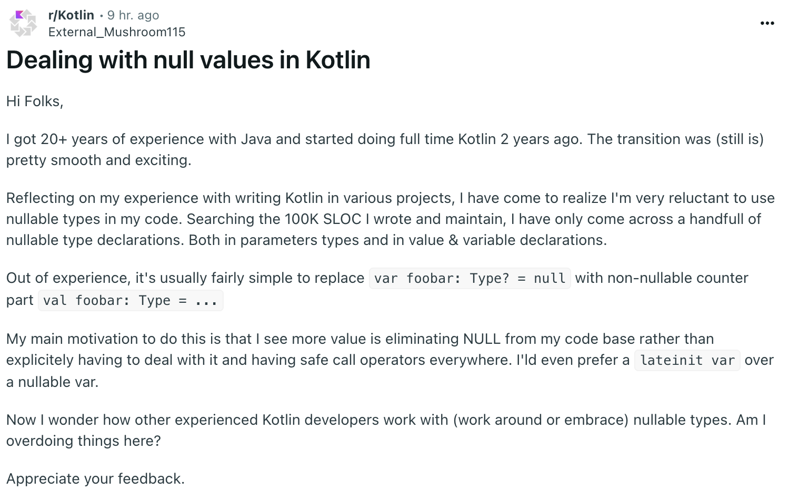

<iframe src="https://embed.reddit.com/r/Kotlin/comments/1ieifc8/dealing_with_null_values_in_kotlin"    scrolling="no" width="100%" height="316"></iframe>

## 원문 상황



OP가 제기한 상황:

- Kotlin에서 null을 다룰 때 어떤 방식이 가장 좋은지에 대한 고민
- 특히 여러 개의 nullable 값들을 처리할 때 코드가 지저분해지는 문제 제기
- 실제 코드에서 많은 `?.`와 `?:`가 반복되는 상황
- 그렇기에 nullable var 보다 `lateinit var`를 더 선호함.

## 제안된 해결 방식들

### 1. Scope Functions 활용

```kotlin
// Before
if (user?.address?.city?.zipCode != null) {
    processZipCode(user.address.city.zipCode)
}

// After
user?.address?.city?.zipCode?.let { 
    processZipCode(it)
}
```

### 2. Early Return 패턴

```kotlin
fun processUser(user: User?) {
    // Early return for null cases
    if (user == null) return
    if (user.address == null) return
    
    // Main logic with non-null values
    processAddress(user.address)
}
```

### 3. Elvis 연산자와 기본값 활용

```kotlin
val cityName = user?.address?.city?.name ?: "Unknown City"
```

### 4. Sealed Class/Interface 활용

```kotlin
sealed interface Result<out T> {
    data class Success<T>(val data: T) : Result<T>
    data class Error(val message: String) : Result<Nothing>
}

fun getUser(): Result<User> {
    return try {
        Result.Success(fetchUser())
    } catch (e: Exception) {
        Result.Error("Failed to fetch user")
    }
}
```

## Real-world use cases

Interview with a Backend Engineer Working with Kotlin Spring Boot. Here's how they handle null values in their production environment:

### 1. Domain Layer Pattern

```kotlin
data class UserProfile(
    val name: String,
    val email: String?,
    val phoneNumber: String?
) {
    fun hasValidContact() = !email.isNullOrBlank() || !phoneNumber.isNullOrBlank()
    
    fun getPrimaryContact() = email ?: phoneNumber ?: throw IllegalStateException("No contact available")
}
```

### 2. Repository Layer Implementation

```kotlin
interface UserRepository {
    fun findByEmail(email: String): User?
    
    fun getByEmail(email: String): User = 
        findByEmail(email) ?: throw NoSuchElementException("User not found")
}
```

#### 3. Service Layer Pattern

```kotlin
@Service
class UserService(private val repository: UserRepository) {
    fun processUserData(email: String): UserDTO {
        return repository.findByEmail(email)
            ?.let { user -> UserDTO.fromEntity(user) }
            ?: throw NotFoundException("User not found with email: $email")
    }
}
```

They emphasized three key aspects of their approach:

1. Clear Separation of Concerns
    - Repository layer handles raw null values
    - Service layer converts nulls to domain-specific exceptions
    - Controllers handle theses exception uniformly
2. Consistent Error Handling
    - Using custom exceptions for domain-specific cases
    - Maintaining a global exception handler
    - Proper error logging and monitoring
3. Testing Strategy
    - Extensive testing of null scenarios
    - Property-based testing for nullable fields
    - Integration tests for the full null-handling flow

## My Thoughts

As a backend engineer working with Kotlin and Spring Boot, I find Kotlin's null handling mechanism both elegant and sometimes challenging. Coming from a Java background, Kotlin's null safety might initially feel cumbersome, but it's actually a powerful feature that prevents many runtime errors we used to face in Java.

On comment from the Reddit discussion particularly resonated with me:

> "`lateinit var` is just Kotlin's way of saying 'let me do it Java style'. Don't use it except when your injection framework needs it."

This perspective brilliantly captures a common anti-pattern in Kotlin development. While `lateinit var` is necessary for framework-level integrations (particularly with Spring's dependency injection, ORM's field injection), overusing it often indicates that we're not fully embracing Kotlin's idioms. It's a reminder that we should strive to use Kotlin's null safety features rather than falling back to Java-style patterns out of habit.

A critical point worth mentioning is that even with Kotlin's robust null safety system, we can still encounter `NullPointerException`s at runtime when dealing with reflection or proxy-based operations. This is particularly relevant in Spring Boot applications where properties marked as non-null in Kotlin code might still receive null values through reflection or proxy mechanisms. This reminds us that while Kotlin's type system is powerful, we need to remain vigilant about the framework's behavior under the hood.

For example:

```kotlin
@Service
class UserService {
    // Marked non-null in Kotlin, but could be null at runtime
    @Value("\${app.someProperty}")
    private lateinit var someProperty: String
    
    // Could throw NPE if property is not defined in application.properties
    fun processProperty() = someProperty.length
}

/**
* or when working with JPA entities where a `@ManyToOne` relationship is marked
* as non-null but the referenced entity doesn't exist in the database
*/
@Entity
@Table(name = "...")
class UserJpaEntity(
    @ManyToOne(fetch = FetchType.EAGER)
    @JoinColumn(name = "memberId")
    val member: MemberJpaEntity
)
```

What fascinates me most is how Kotlin's null safety influences architectural decisions. In my experience, it encourages:

1. More thoughtful API design
    - Forces thoughtful API design
    - Leads to more explicit contract between layers
    - Results in more maintainable codebase
2. Better domain modeling
    - Instead of using null for optional values, we often create more explicit domain concepts
    - Helps in making implicit business rules explicit in code
    - Reduces the complexity of null checking chains
3. Improved testing practices
    - Null cases are more visible and thus better tested
    - Compile-time null checks reduce the need for null-related unit tests
    - Make edge cases more apparent during code review

The discussion on Reddit shows that the community is actively thinking about theses patterns. While there's no one-size-fits-all-solutions, the combination of Kotlin's null safety features with well-thought-out architectural patterns can lead to more robust applications.

Have you faced similar challenges with null handling in you Kotlin projects? How do you balance between null safety and code readability? I'd love to hear your thoughts and experiences!