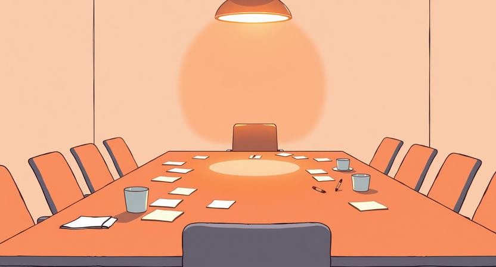

## "왜 아무도 말을 안 하지"

회의실에 여섯 명이 앉아 있다. 화면에는 새 프로젝트의 기획 초안이 띄워져 있다. 리더가 말한다. "의견 있으면 편하게 말해주세요." 침묵. 5초, 10초. 누군가 물을 한 모금 마시고, 누군가 노트북 화면을 내려다본다. 결국 리더가 "그럼 이대로 진행하겠습니다"라고 말하며 회의가 끝난다. 나오면서 복도에서 두 사람이 수군거린다. "솔직히 그 방향 좀 아닌 것 같지 않아?" "나도. 근데 뭐라고 말해야 할지 모르겠어서."

이 장면은 거의 모든 조직에서 반복된다. 의견이 없어서 침묵하는 것이 아니다. 의견은 있는데 말하지 못하는 것이다. 그리고 그 이유는 대부분의 사람이 생각하는 것과 다르다.

## 침묵의 원인은 아이디어 부족이 아니다

회의에서 사람들이 말을 안 하는 이유를 물어보면, 흔히 "마땅한 아이디어가 없어서"라는 답이 돌아온다. 하지만 복도에서 수군거리는 장면이 보여주듯, 아이디어는 있다. 부족한 것은 아이디어가 아니라 확신이다. "이걸 말해도 될까"라는 확신. "이런 수준의 의견을 꺼내도 괜찮을까"라는 확신. "내가 틀리더라도 이 팀에서는 괜찮을까"라는 확신.

이 확신은 개인의 성격이나 용기와는 별로 관계가 없다. 아무리 대담한 사람이라도, 낯선 팀에서 첫 회의에 참석하면 말을 아끼게 된다. 반대로 내성적인 사람도, 안전하다고 느끼는 팀에서는 놀라울 정도로 날카로운 의견을 낸다. 발언은 개인의 속성이 아니라 환경의 산물이다.

그렇다면 그 환경은 무엇으로 만들어지는가. 심리적 안전감이라는 말이 자주 쓰이지만, 그건 결과에 가깝다. 심리적 안전감이 생기려면 그 전에 먼저 필요한 것이 있다. 팀이 자기 자신에 대해 알고 있어야 한다. "우리는 어떤 팀인가"에 대한 공유된 감각. 이것이 없으면, 발언의 문턱이 무한히 높아진다.

## '시원찮은 기획'에 대해 말하는 이유

기획 회의에서 보통 사람들이 말을 꺼내는 순간은 "좋은 아이디어가 떠올랐을 때"다. 충분히 정리되고, 논리적으로 말이 되고, 반박당하지 않을 만큼 단단한 아이디어. 그래서 회의 시간의 대부분이 침묵으로 채워진다. 완벽한 아이디어가 떠오르기를 기다리는 침묵.

하지만 좋은 논의가 일어나는 팀에서는 정반대의 일이 벌어진다. 사람들이 시원찮은 아이디어를 먼저 꺼낸다. "이게 맞는지 모르겠는데", "좀 엉뚱할 수 있는데", "일단 날것 그대로 던져볼게" 같은 전제를 달고 불완전한 생각을 내놓는다. 그리고 그 불완전한 생각 위에 다른 사람의 생각이 얹히면서, 혼자서는 도달할 수 없었던 방향이 만들어진다.

시원찮은 기획에 대해 말할 수 있다는 것은, 그 팀에 두 가지가 있다는 뜻이다. 첫째, 불완전한 것을 내놓아도 판단받지 않을 것이라는 믿음. 둘째, 불완전한 것이 팀을 통과하면서 더 나아질 것이라는 믿음. 이 두 가지 믿음은 구호로 만들어지지 않는다. 실제 경험의 축적으로만 만들어진다.

## '우리다운 것'이 발언의 문턱을 낮추는 원리

"우리는 어떤 팀인가"라는 질문에 구성원들이 비슷한 답을 할 수 있는 팀이 있다. "우리 팀은 일단 빠르게 해보는 팀이야", "우리는 데이터 없이는 결정 안 하는 팀이야", "우리는 고객 앞에서 직접 부딪히는 팀이야." 이런 답이 팀 안에서 자연스럽게 공유되어 있을 때, 그것이 발언의 기준점이 된다.

기준점이 있으면 발언이 쉬워진다. "우리가 빠르게 해보는 팀이라면, 이건 너무 오래 고민하고 있는 거 아닌가?"라는 말이 자연스럽게 나올 수 있다. "우리가 데이터 기반으로 결정하는 팀이라면, 이 결정에는 근거가 부족한 것 같다"는 지적이 공격이 아니라 정상적인 점검이 된다. 발언의 근거가 개인의 판단이 아니라 팀의 합의된 정체성에 있기 때문이다.

반대로 "우리다운 것"이 없는 팀에서는, 모든 발언이 개인의 의견으로 읽힌다. "이건 너무 느린 것 같다"고 말하면 "너는 그렇게 생각하는구나"로 끝나거나, "내 일에 왜 참견하지?"로 받아들여진다. 같은 말이라도, 팀의 정체성 위에서 하는 말과 개인의 취향으로 하는 말은 무게가 다르다. 전자는 논의의 시작이 되고, 후자는 감정의 충돌이 된다.

"우리다움"은 거창한 것이 아니다. 팀이 일하면서 자연스럽게 형성된 패턴, 반복된 선택, 공유된 기억. 이것들이 쌓여서 "우리는 이런 식으로 하는 팀"이라는 감각이 만들어진다. 그 감각이 있으면, 발언은 "내 개인적인 생각인데"가 아니라 "우리 팀답게 보면"으로 시작할 수 있다. 그 차이가 침묵과 논의를 가른다.

## 과거 발언을 되짚어 팀원을 영웅으로 만드는 기술

"우리다움"을 만드는 가장 효과적인 방법 중 하나는, 과거에 누군가가 했던 발언을 되짚어주는 것이다. "지난번에 수진 님이 말했던 그 포인트 있잖아요, 사용자 인터뷰를 먼저 하자고 했던 거. 그때 그 방향으로 갔더니 결과적으로 맞았거든요." 이 한마디가 만드는 효과는 생각보다 크다.

첫째, 수진이라는 사람의 발언이 팀의 역사에 기록된다. "내가 했던 말이 기억되고 있구나"라는 감각은, 다음에도 말할 이유를 만든다. 둘째, 팀 전체에 "발언은 흘러가는 것이 아니라 축적되는 것"이라는 메시지가 전달된다. 내가 오늘 하는 말이 한 달 뒤에도 의미를 가질 수 있다는 감각. 이것이 발언의 동기를 만든다.

셋째, 그리고 이것이 가장 중요한 효과인데, 과거의 발언이 좋은 결과로 이어진 사례를 팀이 공유하면, "우리 팀에서는 이런 발언이 가치 있다"는 기준이 생긴다. 추상적인 원칙이 아니라, 실제 인물과 실제 사건에 기반한 기준. "수진 님처럼 초기에 방향을 짚어주는 말이 우리 팀에서는 중요하다"는 것을 모두가 체감하게 된다.

과거 발언을 되짚는 것은 단순한 칭찬이 아니다. 팀의 기억을 구성하는 행위다. 그리고 팀의 기억이 쌓여야 팀의 정체성이 만들어진다.

## 좋은 퍼실리테이터는 자기가 아니라 팀을 영웅으로 만든다

회의를 잘 이끄는 사람을 보면, 공통점이 있다. 자기가 좋은 아이디어를 내는 사람이 아니라, 다른 사람의 좋은 아이디어를 발견하는 사람이라는 것이다.

나쁜 퍼실리테이션은 리더가 답을 이미 가지고 있으면서 질문의 형식을 빌리는 것이다. "어떻게 생각해요?"라고 물어놓고, 원하는 답이 나올 때까지 "그것도 좋지만..."을 반복하는 것. 팀원들은 금방 눈치챈다. 어차피 답이 정해져 있다는 것을. 그러면 다음 회의부터 입을 닫는다.

좋은 퍼실리테이션은 다르다. 누군가 불완전한 아이디어를 꺼내면, 그 안에서 가치 있는 조각을 찾아 이름을 붙여준다. "지금 민수 님이 말한 건, 우리가 B2C 관점에서만 보고 있었다는 지적인 것 같은데, 이거 중요한 포인트인 것 같아요." 민수가 스스로도 정리하지 못했던 자기 생각이, 다른 사람의 해석을 통해 선명해진다. 그 순간 민수는 "나도 기여할 수 있구나"를 체험한다.

이런 경험이 반복되면 팀에 순환이 생긴다. 불완전한 발언 → 가치 발견 → 더 많은 발언 → 더 깊은 논의. 이 순환의 시작은 리더의 화려한 인사이트가 아니라, 팀원의 서툰 한마디를 주워 올리는 행위에 있다.

결국 논의가 시작되려면, 팀이 먼저 자기 자신을 알아야 한다. "우리는 어떤 팀인가", "우리는 어떤 발언을 중요하게 여기는가", "우리의 과거에는 어떤 순간이 있었는가." 이 질문들에 팀원 모두가 비슷한 대답을 할 수 있을 때, 침묵은 비로소 깨진다. 안전하다는 느낌은 제도나 규칙에서 오는 것이 아니라, "이 팀은 나를 포함해서 우리다"라는 감각에서 온다. 그 감각이 없으면, 아무리 "편하게 말해주세요"를 반복해도 회의실의 공기는 바뀌지 않는다.
