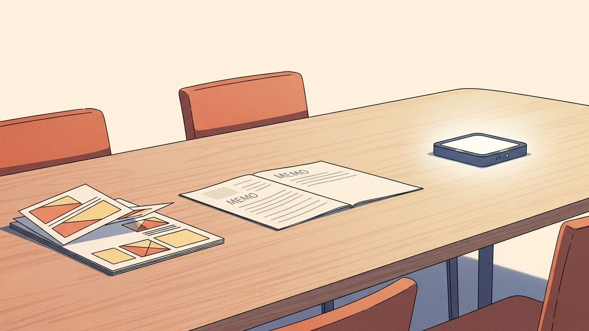

## 회의실의 가구는 그 시대의 인식이다

회의실은 가구가 단순해 보이는 공간이다. 책상이 있고 의자가 있고 벽에 화면이 걸려 있다. 그런데 그 책상 위에 무엇이 놓이는가는 단순하지 않다. 거기 놓인 한 가지가 그 조직이 무엇을 진실로 여기는지를 드러낸다. 슬라이드의 시대가 있었고, 메모의 시대가 있었다. 이제 프로토타입이 그 자리에 올라간다.

도구가 바뀐다는 말은 도구가 바뀐다는 뜻이 아니다. 회의의 주체가 한 칸씩 이동한다는 뜻이다. 발표자에서 독자로, 독자에서 사용자로. 가구는 매번 그다음 자리로 옮겨 앉은 사람을 위해 새로 들어온다.

## 슬라이드는 발표자의 시선이었다

PowerPoint는 말하는 사람을 보호하는 도구다. 빈 곳은 말로 메우면 되고, 정렬된 표는 그것만으로 동의처럼 보인다. 전환 효과는 흐름의 빈틈을 가린다. 청중은 화면을 따라가고, 따라가는 동안에는 의문을 잠시 미룬다. 슬라이드 회의가 끝나면 모두가 같은 결론에 동의한 것 같지만, 막상 다음 주에 만나보면 각자 다른 결론을 들고 있는 일이 흔하다.

슬라이드의 진짜 비용은 잉크가 아니라 검증의 유예에 있다. 발표자가 말하는 동안 청중은 듣는 척을 할 수 있고, 듣는 척이 끝나면 회의도 끝난다. 무엇이 합의되었는지는 회의 후에 밝혀진다. 보통은 합의된 게 별로 없다.

## 메모는 독자의 시선이다

2004년 Bezos는 Amazon 임원 회의에서 PowerPoint를 폐지하고 6쪽 메모를 강제했다. 회의의 첫 30분은 침묵이다. 모두가 같은 텍스트를 같은 속도로 읽는다. 발표하지 않고, 끄덕이지 않고, 페이지만 넘긴다. 그다음에 토론이 시작된다.

이 한 가지 결정이 회의실의 권력 구조를 옮겼다. 누가 더 매끄럽게 말하느냐가 아니라, 누가 더 조밀하게 썼느냐가 중요해졌다. 합의의 단위는 '인상'에서 '문장'으로 내려왔다. 메모는 청중을 보호하지 않는다. 부족한 논리를 가리는 슬라이드 효과가 없다. 6쪽 안에서 모순이 드러나면 그 모순이 그대로 회의 테이블 위에 올라온다.

메모 회의가 어색한 이유도 여기에 있다. 발표자가 두르던 보호막이 사라지고, 독자가 따져 읽는 시선이 그 자리에 들어선다. 그 시선은 친절하지 않다. 친절은 발표자의 일이었지, 독자의 일이 아니다.

## 두 문화는 오래 공존했다

흥미로운 사실은 메모 시대가 슬라이드 시대를 완전히 대체한 적이 없다는 점이다. 한쪽에는 이미지 한 장 없이 텍스트만으로 한 페이지를 채우는 1-Pager 조직이 있었다. 다른 한쪽에는 이해하기 쉬운 도식과 색을 정성껏 깐 PPT 조직이 있었다. 이 두 문화는 같은 시기 같은 도시에서 나란히 굴러갔고, 둘 중 어느 쪽이 옳았는지는 끝내 판정되지 않았다.

1-Pager 조직은 합의가 정확했다. 문장에 적힌 그대로가 합의의 내용이었고, 다음 주에 만나도 해석이 어긋나지 않았다. PPT 조직은 합의가 빨랐다. 한 장의 도식이 다섯 페이지의 설명을 대신했고, 회의 시간이 짧았다. 정확함과 빠름은 둘 다 자산이고, 어느 시점에 어느 자산을 더 필요로 했느냐는 산업과 단계에 따라 달랐다.

진화한다는 말은 위로 올라간다는 말이 아니다. 환경이 바뀌면 그 환경에서 살아남는 도구가 달라진다는 말이다. 슬라이드 시대도 메모 시대도, 정답이어서 그 자리에 있던 게 아니다. 그 시대의 비용 구조에 가장 잘 맞는 도구였기에 그 자리에 있었다. 만드는 비용이 비싸고 검토 시간이 쌌던 시기에는 잘 다듬은 메모 한 편이 효율이었고, 그림 한 장으로 의사결정자의 직관에 닿는 게 더 빠르던 시기에는 PPT가 효율이었다.

## 프로토타입은 사용자의 시선이다

지금 회의실에 새로 들어오는 가구는 프로토타입이다. AI는 만드는 비용을 0에 수렴시키는 중이고, 비용이 무너지면 회의의 단위도 같이 무너진다. 만들기 전에 합의하던 시대에서, 만들어 놓고 합의하는 시대로 이동한다.

프로토타입이 책상 위에 올라오면 회의의 문법이 다시 한 번 바뀐다. 자료가 아니라 객체다. 텍스트는 사라지지 않으려 애쓰는데, 객체는 그저 만져지길 기다린다. 발표자의 보호막도, 독자가 따져 읽는 시선도 거기서는 작동하지 않는다. 사용자가 한 번 클릭하면, 다섯 페이지의 메모와 스무 장의 슬라이드가 동시에 무력해지는 순간이 있다.

이것도 정답이어서가 아니다. 만드는 비용이 무너졌으니, 회의의 단위도 따라 무너진 것뿐이다. 비용이 다시 올라간다면 메모가 돌아올 것이고, 메모마저 비싸다면 슬라이드가 돌아올 것이다. 가구는 환경의 함수다.

## 가구를 바꿔도 시선은 잘 안 바뀐다

여기서 가장 자주 어긋나는 지점이 있다. 책상 위에 프로토타입을 올려놓아도, 회의는 여전히 발표자의 회의로 흘러간다. 누군가 시연하고, 나머지는 끄덕인다. 화면 속에서 무엇이 동작하는지를 한 사람이 설명하고, 청중은 다시 슬라이드 시대의 자세로 앉아 있다. 가구는 바뀌었는데 시선은 바뀌지 않은 회의실이다.

도구가 시선을 바꾸는 게 아니라, 시선이 바뀐 사람만이 도구를 알아본다. PPT 시대에 메모를 들고 오던 사람이 있었고, 메모 시대에 프로토타입을 들고 오던 사람이 있었다. 가구는 늘 한발 늦게 도착한다. 먼저 도착해 있던 것은 시선이다.

이 비대칭이 조직마다 격차를 만든다. 같은 도구를 들여놓아도, 그 도구가 가리키는 시선을 가진 사람이 회의실 안에 몇 명이냐가 결과를 가른다. 도구는 비교적 쉽게 산다. 시선은 그렇게 쉽게 사지 못한다.

## 다음 가구는 무엇인가

모든 시대의 회의 도구는 그다음 도구가 와야 자신의 한계를 드러낸다. 메모의 시대는 슬라이드의 부재를 드러냈고, 프로토타입의 시대는 메모의 침묵을 드러낸다. 다음에 올 것이 무엇인지 묻는 일은 흥미롭지만, 그 질문은 종종 지금을 회피하기 위한 질문이 된다.

지금 회의실에 놓인 것이 무엇을 가리고 있는지를 보는 편이 정직하다. 슬라이드가 가리고 있던 것이 검증이었다면, 메모가 가리고 있던 것은 만져봐야 알 수 있는 무엇이었다. 프로토타입이 가리고 있는 것은 아직 잘 모른다. 모른 채로, 그 가구를 책상 위에 올려두는 일이 지금의 회의다.
