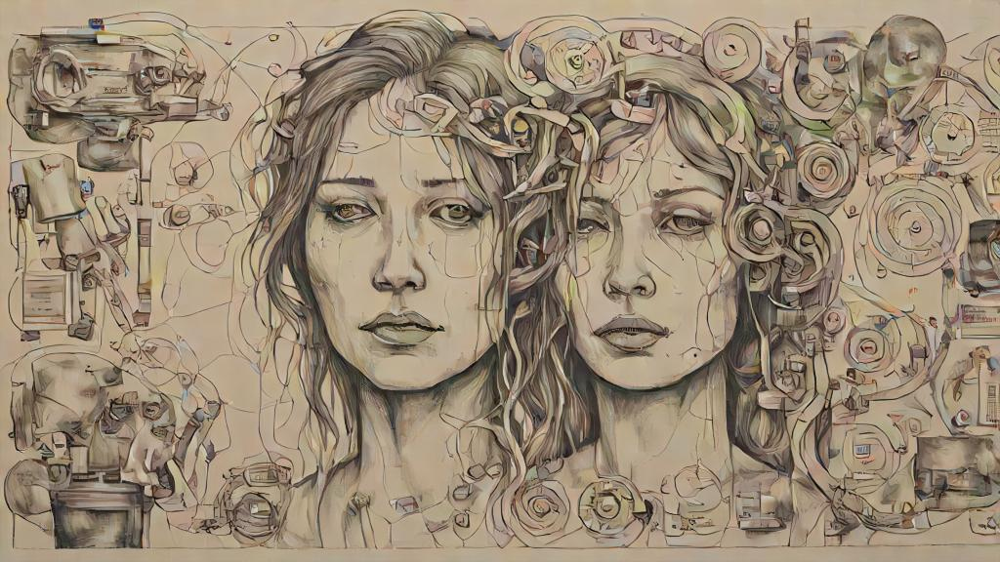

어느순간부터 특별히 하고 싶은게 없었던 것 같다. 물론 아예 없는건 아니었지만, 일 자체와 일에 관련된 여러 고민이 나에게 즐거움을 주는 주요한 요인들이었다.

그러다보니 일상적인 부분에서 도파민 분출이 약해진 듯 하다. 예쁜 하늘, 아름다운 풍경, 맛있는 음식 같은 곳에서 느끼는 즐거움이 많이 줄어들었다.

일이 아닌 것에서 즐거움과 행복을 느끼는 때는 주로 혼자서 완전 새로운 것을 시도하거나 상대방의 반응에서 오곤 했다.

상대방이 먼저 무언가를 해보고 싶어하거나 어딘가에 가보고 싶어하고, 무언가를 먹어보고 싶다고 할 때 상대가 원하는 것을 해볼 수 있도록 돕고, 함께 그것을 했을 때 상대가 행복해하는 모습에서 대리만족을 느끼며 행복감을 느끼곤 했다. 교육이나 고객 만족을 위해 고민하는 것도 비슷한 맥락이었다.

그런데 최근 지인과 대화를 나누면서 되게 화려하거나 대단할 것 없는 시간인데도 그 시간이 즐겁고 행복하더라. 왜 그럴까, 너무 궁금했다.

저런 생각을 해오던 중, 문득 그 대화는 내가 평소에 느끼던 '상대를 위한 행동'에서 오는 대리만족과 다른, 더 직접적이고 순수한 연결감을 준다는 느낌을 받았다.

상대를 위하는 생각과 행동이 아니라, 정말 나에 대해 생각해볼 수 있게끔 도움되었달까? 평소에는 다른 사람의 즐거움을 위해 행동하면서 간접적으로 행복을 느꼈는데, 그 덕분에 온전히 내 자신으로 있을 때도 직접적인 행복을 경험하게 되었다. 이런 경험이 낯설지만 새롭고 특별했다.
