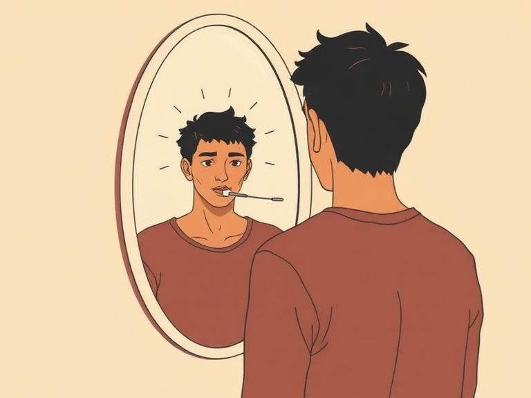

회의에서 내가 강하게 밀었던 방향이 있었다. 근거도 충분했고, 논리도 깔끔했다. 팀원들이 다른 의견을 냈지만 나는 확신이 있었다. 그래서 밀어붙였다. 몇 주 뒤, 그 판단이 틀렸다는 게 드러났다. 돌아보니 당시 팀원들의 반론이 더 정확했다. 그때 느꼈던 그 강한 확신은 대체 어디서 온 것이었을까. 이상한 건, 틀렸다는 사실을 알고 난 뒤에도 당시의 확신이 '가짜'였다는 느낌이 들지 않는다는 것이다. 그만큼 확신은 생생하고 설득력 있었다.

[이전 글](/뇌는-설명하고-싶다/)에서 좌뇌의 해석 장치를 이야기했다. 뇌가 빈칸을 채우기 위해 자동으로 이야기를 만들어낸다는 것. 그런데 해석 장치에는 한 가지 더 무서운 특징이 있다. 만들어낸 이야기에 절대적인 확신을 부여한다는 점이다.

## 틀린 설명에 붙은 절대적 확신

가자니가의 분리뇌 실험에서 가장 놀라운 부분은 환자들의 대답이 틀렸다는 것이 아니다. 그 대답에 보인 확신의 강도다.

닭발과 눈 풍경 실험을 떠올려 보자. 환자는 왼손으로 삽을 고른 이유를 "닭장 청소에 필요하니까"라고 설명했다. 이 설명은 완전히 틀렸다. 하지만 환자에게 "정말요? 다시 생각해 보세요"라고 물으면, 환자는 자신의 답에 절대적인 확신을 보였다. 의심의 여지가 없다는 듯이. 더 흥미로운 건, 이 확신이 정답을 말할 때의 확신과 구별이 불가능하다는 점이다.

우뇌에 "웃으세요"라는 지시를 보여줬을 때도 마찬가지였다. 환자는 웃기 시작했고, 이유를 묻자 "당신들이 매번 와서 실험하니까 웃긴 거예요"라고 했다. 가자니가가 그 답에 의문을 제기해도 환자는 흔들리지 않았다. 자기 설명이 맞다고 굳게 믿었다. 좌뇌의 해석 장치는 이야기를 만들어낼 뿐 아니라, 그 이야기에 '진실'이라는 도장까지 찍어버린다.

## 현실을 부정하는 뇌

20세기의 가장 혁신적인 신경과학자 라마찬드란(V.S. Ramachandran)은 이 현상을 더 극적인 상황에서 관찰했다. 그가 연구한 것은 뇌졸중으로 왼쪽 몸이 완전히 마비된 환자들이었다. 이 환자들 중 일부는 자신의 마비를 인정하지 않았다. 의학에서 질병인식불능증(anosognosia)이라 부르는 상태다.

라마찬드란이 마비된 왼팔을 가리키며 "이 팔을 움직일 수 있나요?"라고 물으면, 환자는 자신 있게 "그럼요, 당연히 움직일 수 있죠"라고 답했다. 실제로 해보라고 하면 팔은 꿈적도 하지 않았다. 그런데 환자는 이렇게 말했다. "지금은 좀 피곤해서요." 또는 "오늘 하루 종일 의사들이 여기저기 수석 보고 갔단 말입니다. 지금은 팔을 움직이고 싶지 않은 거예요."

마비된 팔이 눈앞에 축 늘어져 있는데도, 좌뇌는 이 현실을 받아들이지 않았다. 대신 합리화를 시도했다. "피곤하다", "하기 싫다", "아프니까". 매번 다른 설명을 만들어냈고, 매번 확신에 차 있었다.

가자니가의 분리뇌 환자와 라마찬드란의 마비 환자가 보여주는 것은 같다. 좌뇌의 해석 장치는 현실이 자신의 이야기와 맞지 않을 때, 현실을 수정하는 것이 아니라 이야기를 수정한다. 그리고 수정된 이야기에도 같은 강도의 확신을 부여한다.

## 회의실에서 일어나는 같은 일

이 현상이 뇌 손상 환자에게만 일어난다고 생각하면 오산이다.

프로젝트가 실패했을 때를 떠올려 보라. 우리는 즉시 원인을 분석한다. "시장 타이밍이 안 맞았어", "리소스가 부족했어", "고객의 요구를 잘못 읽었어". 이 분석들은 그럴듯하다. 하지만 솔직히 물어보자. 그 분석은 사실의 재구성인가, 아니면 좌뇌가 불편한 실패에 설명을 붙이려는 시도인가. 많은 경우, 진짜 원인은 우리가 말한 것과 다르다. 하지만 해석 장치가 만든 설명이 워낙 그럴듯하고 확신에 차 있어서, 우리는 더 깊이 파고들지 않는다.

피드백을 받을 때도 같은 일이 벌어진다. 누군가 내 작업에 비판적 의견을 주면, 뇌는 즉시 방어 서사를 만든다. "저 사람은 맥락을 모르니까", "관점이 다른 거지 틀린 건 아니야", "내가 더 오래 고민한 건데". 이 생각들이 틀린 것은 아닐 수 있다. 문제는 이 생각이 얼마나 빠르고 자동적으로 생성되는지, 그리고 우리가 그것을 얼마나 즉각적으로 믿어버리는지다.

성공에 대해서도 마찬가지다. 좋은 결과가 나오면 우리는 그것을 자신의 판단과 노력 덕분이라고 해석한다. 물론 그것이 사실일 수도 있다. 하지만 운이 좋았거나, 팀원의 기여가 결정적이었거나, 시장이 우연히 좋았을 가능성은 쉽게 무시된다. 성공의 서사에서 좌뇌는 '나'를 주인공으로 만들고 싶어 한다.

## 확신을 의심하는 연습

그러면 어떻게 해야 할까. 해석 장치를 끌 수는 없다. 그것은 뇌의 기본 작동 방식이다. 하지만 인식할 수는 있다.

가자니가의 연구가 우리에게 주는 실질적인 교훈은 하나다. 확신의 강도는 정확성의 지표가 아니다. 완전히 틀린 설명에도 절대적 확신이 붙을 수 있다. 분리뇌 환자가 그랬고, 마비를 부정하는 환자가 그랬고, 매일의 회의실에서 우리가 그렇다.

실천할 수 있는 것은 간단하다. 확신이 강하게 느껴지는 순간, "이 확신은 어디서 왔지?"라고 한 번 물어보는 것이다. 내가 이 판단에 확신을 느끼는 건 정보가 충분해서인가, 아니면 좌뇌가 빈칸을 너무 매끄럽게 채워서인가. 이 질문 하나만으로 해석과 사실 사이에 한 뼘의 거리를 만들 수 있다.

특히 다음과 같은 상황에서 이 질문이 유효하다. 실패의 원인을 "확실히" 안다고 느낄 때. 누군가의 피드백이 "분명히" 틀렸다고 느낄 때. 내 선택의 이유를 "명확하게" 설명할 수 있다고 느낄 때. 이 '확실히', '분명히', '명확하게'라는 느낌 자체가 해석 장치의 서명일 수 있다.

확신이 흔들리는 순간은 불편하다. 하지만 분리뇌 연구가 보여주듯, 한 번도 흔들리지 않는 확신이야말로 가장 의심해봐야 할 것이다. 불편한 의심 속에 진실이 있고, 편안한 확신 속에 해석 장치의 소설이 숨어 있을 수 있다. 지금 당신이 가장 확신하는 그 판단 하나를 골라보라. 그리고 물어보라. 이것은 내가 안 것인가, 내 뇌가 지어낸 것인가.
